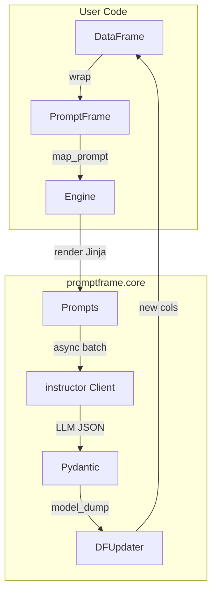

# Design Doc — promptframe
_A lightweight bridge between Pandas rows and instructor-powered, Jinja-templated, structured-LLM extraction._

## Table of Contents
1. Problem Statement
2. Goals / Non-Goals
3. High-Level Architecture
4. API Surface
5. Execution Model
6. Error Handling & Retries
7. Dependencies
8. MVP Checklist
9. Future Work
10. Appendix: Performance Benchmarks

---

## 1. Problem Statement
Stakeholders frequently want to **add LLM-derived features to tabular data**:
* Map each row to a prompt (often templated).
* Parse the response into _multiple_ structured fields.
* Write those fields back as new DataFrame columns.
No existing lib offers a _pandas-native_, **type-safe**, _retry-aware_, vectorised path.

## 2. Goals / Non-Goals
| Goal | Out of scope |
|------|--------------|
| Row-wise & batched LLM extraction | Full SQL/Polars support (v2) |
| Pydantic validation (via instructor) | On-device LLM inference |
| Async first, sync wrapper | In-memory caching (v1 uses on-disk) |

## 3. High-Level Architecture



* **PromptFrame** – thin façade (state = DataFrame + errors list).
* **Engine** – async orchestrator (concurrency, batching).
* **Caller** – `client = instructor.from_provider("openai/gpt-4o")`.
* **DFUpdater** – mutates new dotted-path columns (`analysis.summary`, …).

## 4. API Surface

```python
PromptFrame(df, *, client=None, max_concurrency=32)

PromptFrame.map_prompt(
    name: str,
    template: str | Callable[[pd.Series], str],
    schema: Type[BaseModel],
    *,
    llm_model: str = "openai/gpt-4o",
    template_kwargs: dict | Callable[[pd.Series], dict] | None = None,
    batch_size: int = 8,
    progress: bool = True,
    **provider_kwargs                  # temperature, top_p, etc.
) -> PromptFrame
```

*Returns self for chaining.*

## 5. Execution Model

1. **Prompt Rendering**

   * `jinja2.Environment` compiled once per unique template string.
2. **Async Pipeline**

   * Use `httpx.AsyncClient` inside instructor (already patched).
   * Semaphore caps concurrency (`max_concurrency`).
3. **Batch Strategy**

   * If `batch_size > 1`, concat prompts with `---` fence; expect list of model objs back (requires few-shot splitter in template).
   * Convert list→dict with row index mapping.

## 6. Error Handling & Retries

* **Tenacity integration** – instructor already provides retry logic for API failures.
* **Validation errors** – captured per-row and stored in `PromptFrame.errors`.
* **Template errors** – fail fast with clear error messages.
* **Graceful degradation** – continue processing other rows when one fails.

## 7. Dependencies

| Package    | Reason                            | Min Version |
| ---------- | --------------------------------- | ----------- |
| pandas     | DataFrame backbone                | 2.2         |
| instructor | structured LLM calls              | latest      |
| jinja2     | template rendering                | 3.0         |
| pydantic   | data validation                   | 2.0         |
| tqdm       | progress bars (optional)          | 4.0         |

## 8. MVP Checklist

* [x] Basic PromptFrame & map_prompt
* [x] Async engine with semaphore
* [x] Column expansion
* [x] Jinja template support
* [x] Error handling
* [ ] Unit tests (pytest)
* [ ] Integration tests
* [ ] Documentation examples

## 9. Future Work

* Polars & DuckDB adapters
* Automatic change-detection (only run on new rows)
* Disk/Redis cache
* Streaming support for large datasets
* Custom retry strategies
* Cost tracking and optimization

## 10. Appendix: Performance Benchmarks

Target performance metrics:
* **Throughput**: 100+ rows/minute for simple extraction
* **Concurrency**: Configurable up to 100 concurrent requests
* **Memory**: Linear scaling with DataFrame size
* **Latency**: <1s overhead for template rendering and column expansion